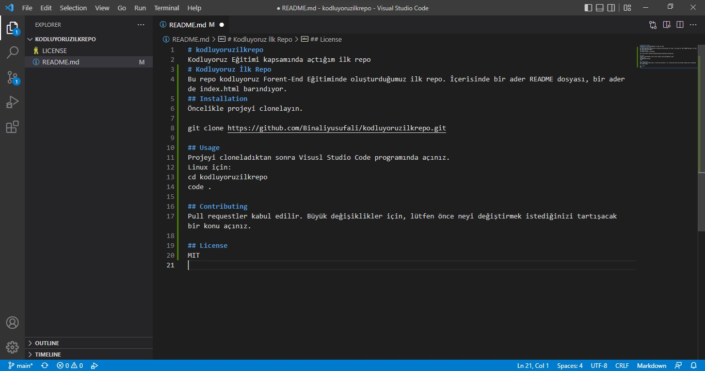

# kodluyoruzilkrepo
Kodluyoruz Eğitimi kapsamında açtığım ilk repo
# Kodluyoruz İlk Repo
Bu repo kodluyoruz Forent-End Eğitiminde oluşturduğumuz ilk repo. İçerisinde bir ader README dosyası, bir ader de index.html barındıyor.
## Installation
Öncelikle projeyi clonelayın.

git clone https://github.com/Binaliyusufali/kodluyoruzilkrepo.git

## Usage
Projeyi cloneladıktan sonra Visusl Studio Code programında açınız.
Linux için:
cd kodluyoruzilkrepo 
code .

## Contributing
Pull requestler kabul edilir. Büyük değişiklikler için, lütfen önce neyi değiştirmek istediğinizi tartışacak bir konu açınız.

## License
MIT

